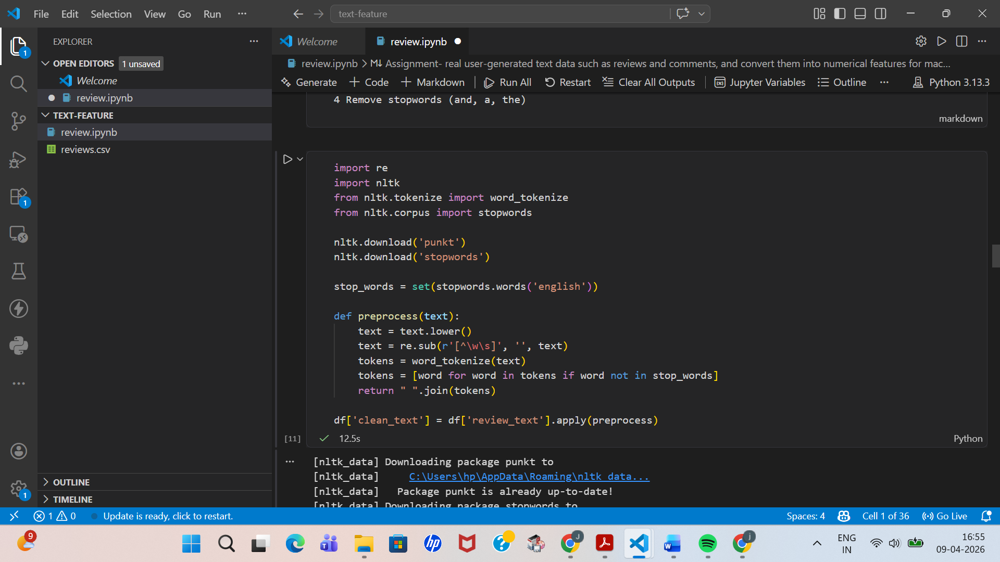
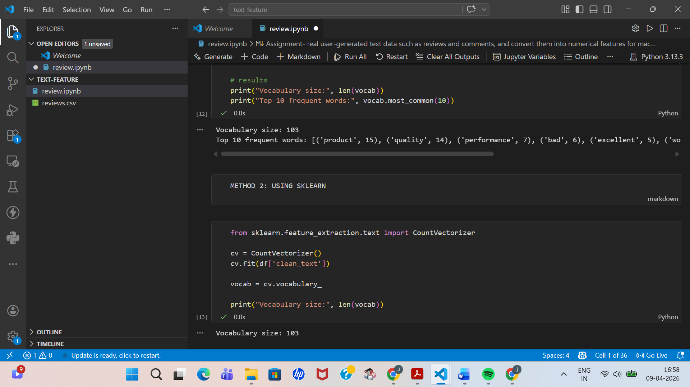
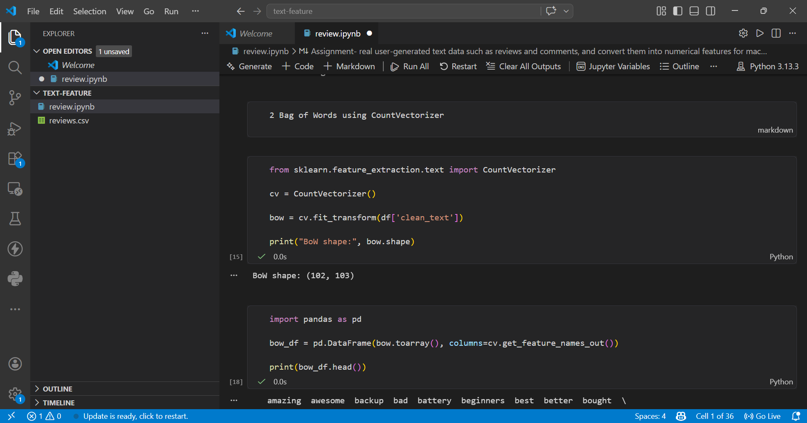
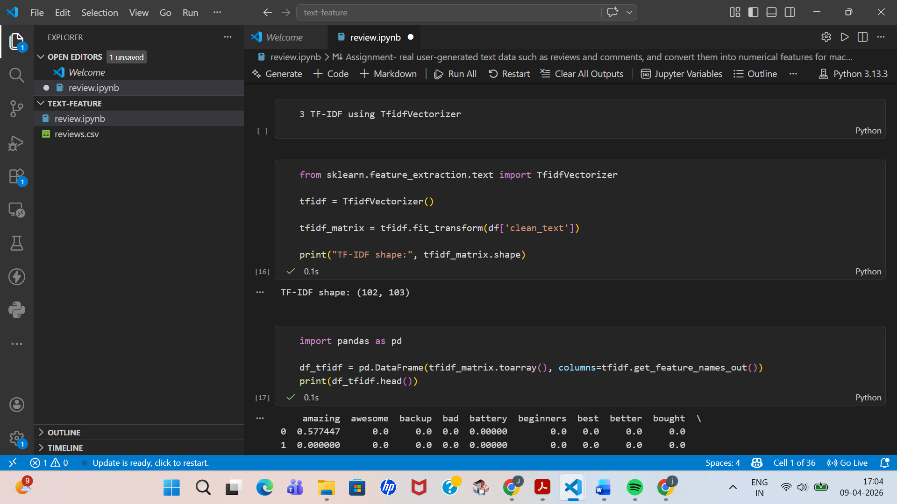
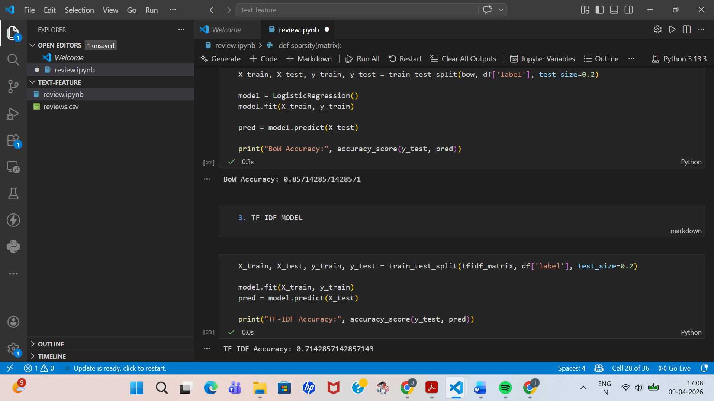

# Text Feature Engineering

## Overview

This project demonstrates how raw text data (product reviews) can be converted into numerical features for machine learning using basic NLP techniques.

---

## Techniques Used

- Text preprocessing
- Vocabulary creation
- One Hot Encoding
- Bag of Words
- TF-IDF

---

## Model

- Logistic Regression for sentiment classification

---

## Key Findings

- Bag of Words captures frequency but ignores importance
- TF-IDF provides better feature representation
- Feature matrices are highly sparse

---

## Outputs

### Preprocessing

### Vocabulary

### Bag of Words

### TF-IDF

### Accuracy

---

## Files

- `review.ipynb` → implementation
- `reviews.csv` → dataset
- `report.docx` → detailed explanation

---

## Conclusion

TF-IDF is more effective than Bag of Words for representing important words, though both methods have limitations in understanding context.

---
